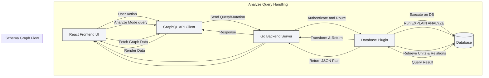

# Request Lifecycle & Data Flow

Understanding the journey of your actions within WhoDB—from input through UI to final data visualization—is crucial to mastering the product. This page traces how user requests propagate through the system, highlighting key components, communication points, and data transformations. By following typical scenarios like executing a chat query, fetching table rows, or visualizing the database schema graph, you will gain clarity on what happens behind the scenes to achieve your goal.

---

## Overview of the Request Lifecycle

Every user interaction with WhoDB initiates a request journey that passes through several layers:

1. **User Interface (React Frontend)**: You type SQL queries, interact with tables, or navigate schema graphs.
2. **GraphQL API Calls**: The frontend sends GraphQL queries or mutations via Apollo Client.
3. **Backend Server Routing**: The Go backend receives requests, authenticates, and routes them.
4. **Plugin Invocation & Database Interaction**: Dedicated database plugins handle connecting, querying, and transforming data.
5. **Response Processing & Visualization**: The backend returns results to the frontend, where data is rendered or visualized.

This flow ensures a transparent, efficient, and flexible user experience.

---

## User Interface Initiation

### 1. Raw Query Execution Flow

- Users write raw SQL or analysis commands inside the **Scratchpad** (Raw Execute page).
- The UI component `RawExecuteCell` manages queries, toggles between `Query` or `Analyze` modes, and maintains query history for replay.
- Queries are wrapped appropriately for analysis (e.g., prefixing with `EXPLAIN (ANALYZE, FORMAT JSON)` for PostgreSQL).
- When submitted, the UI uses a lazy GraphQL query hook `useRawExecuteLazyQuery` to send the request.

### 2. Exploring Storage Units

- On the **Explore Storage Unit** page, users set filters and pagination parameters for rows.
- Query construction includes where conditions, page size, and page offset.
- GraphQL lazy queries like `useGetStorageUnitRowsLazyQuery` fetch filtered results.
- Inline editing actions invoke mutations to update or delete rows.

### 3. Visualizing the Schema Graph

- The **Graph Page** fetches graph structure data using `useQuery` with the `GetGraphDocument` query.
- Nodes and edges representing storage units and their relationships are created and managed via ReactFlow.
- Layout is handled with the Dagre algorithm integrating through `getDagreLayoutedElements`.

---

## Communication via GraphQL API

WhoDB's frontend uniformly interacts with the backend through GraphQL:

- **Queries** fetch data like raw results, schema graphs, storage units, or AI chat responses.
- **Mutations** modify storage units, add or delete rows, or update settings.

Example query flow in raw execute:

```typescript
rawExecute({ variables: { query: fullQuery }, onCompleted() { /* update UI */ } });
```

Key GraphQL schema types you will encounter:

- `RawExecute(query: String!): RowsResult!` — Execute arbitrary SQL.
- `Row(schema: String!, storageUnit: String!, where: WhereCondition, pageSize: Int!, pageOffset: Int!): RowsResult!` — Query paginated rows.
- `Graph(schema: String!): [GraphUnit!]!` — Retrieve graph data for schema visualization.

This uniform interface simplifies adding new integrations and features.

---

## Backend & Plugin Layer Handling

Upon receiving GraphQL requests, the backend:

- Verifies authentication using stored login profiles.
- Parses incoming queries and delegates tasks to corresponding database plugins.
- Plugins encapsulate database-specific logic, converting WhoDB requests to native queries and executing them.
- Results are transformed into a unified format (`RowsResult`) with columns, rows, and metadata.

For example, running an execution with analysis mode results in:

- Backend plugins running `EXPLAIN ANALYZE` queries.
- Parsed JSON explain output sent back.

Enterprise Edition (EE) features and plugins (e.g., analyze view) conditionally activate based on licensing and database type.

---

## Data Transformation & Visualization

### Raw Execute Page

- Result sets from raw queries are displayed in tabular form.
- For analysis, a dedicated graph component visualizes execution plans.
- Query history allows replaying or editing past queries.

### Explore Storage Unit Page

- Rows are displayed in a paginated, editable table.
- Filters generate complex where conditions that backend parses.
- Users can add, update, or delete rows with immediate UI feedback.

### Graph Page

- Visualizes storage units as nodes and relationships as edges.
- Graph layout algorithms position nodes for clarity.
- Users can pan, zoom, and download diagram images.

---

## Typical User Flows & Scenarios

### Executing a Raw SQL Query

1. Type SQL or analyze command in Scratchpad cell.
2. Submit query, which triggers a GraphQL request.
3. Backend plugin executes query, returns `RowsResult`.
4. UI renders result as a table or an execution plan graph.
5. Your query is saved in local history for reuse.

### Browsing and Managing Data Rows

1. Select a storage unit in the dashboard.
2. Set filters, page size, and request rows.
3. Edit cells inline; changes trigger GraphQL mutations.
4. Add new rows via a dynamic form, invoking mutations on submission.
5. Delete selected rows securely with confirmation.

### Visualizing Database Schema

1. Open Graph visualization page.
2. GraphQL query fetches storage units and relationships.
3. Backend returns `GraphUnit` data including unit details and relation types.
4. ReactFlow renders an interactive graph.
5. Use layout controls to organize graph as needed.

---

## Practical Tips & Best Practices

- **Query Preparation**: Use the provided command prefixes in analyze mode to get detailed execution insights.
- **History Usage**: Leverage query history in Scratchpad to improve productivity and reduce repetitive typing.
- **Pagination Awareness**: For large tables, adjust page size to maintain UI responsiveness.
- **Filter Construction**: Utilize flexible where condition builders to narrow down dataset efficiently.
- **Graph Exploration**: Refresh and relayout graph views to keep your schema overview clean and updated.

---

## Troubleshooting Common Issues

- **Empty or No Query Results**: Ensure your query syntax is correct, and the database plugin supports the requested operation.
- **Analysis Visualization Fails**: Confirm that EE features are enabled and you're connected to a supported database (e.g., PostgreSQL).
- **Slow Data Loading**: Reduce page size or increase filters for large datasets.
- **Mutation Failures**: Check user authentication and permissions; ensure required fields are not empty.

Refer to the [Troubleshooting Common Issues](https://whodb.com/docs/getting-started/troubleshooting/troubleshooting-common-issues) page for further guidance.

---

## Request Lifecycle Summary Diagram

