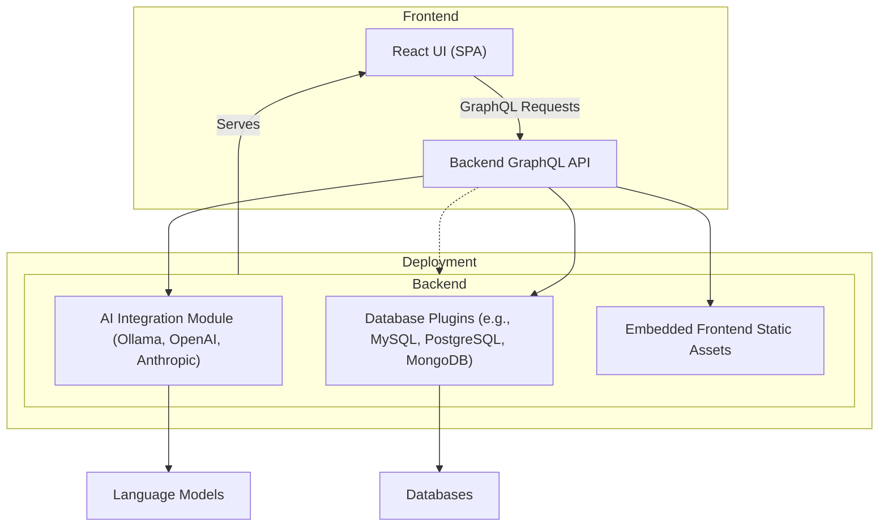

# System Architecture Overview

Discover how WhoDB is architected to deliver a fast, extensible, and agile database management experience through modular separation of frontend and backend components, seamless integration of static assets, and flexible support for Community and Enterprise Editions.

---

## Introduction

WhoDB is designed with a clear focus on user productivity, extensibility, and ease of deployment. This system architecture overview presents how WhoDB separates concerns between the interface and server logic, enabling rapid iteration and scalability. Key architectural decisions emphasize embedding frontend assets for smooth deployment and maintaining a modular backend that supports multiple database types alongside integrated AI-driven features.

Whether you’re installing WhoDB for evaluation or deploying it in production, understanding this architecture will help you configure, troubleshoot, and extend the platform effectively.

---

## Core Architectural Components

### Frontend (UI Client)

- **Role & Responsibilities:**
  The frontend is a React-based single-page application (SPA) built with TypeScript, responsible for providing an intuitive and responsive user interface. It handles user interactions, renders complex database visualizations, facilitates conversational AI queries, and manages inline data editing.

- **Technology Stack:**
  - React with TypeScript
  - Vite for building and development
  - TailwindCSS for theming and styling
  - Apollo GraphQL Client for API communication

- **Static Asset Embedding:**
  Once built, the frontend static files are embedded into the backend server binary. This means the server serves the UI directly, simplifying deployment with no separate frontend server needed.

- **Dynamic Edition Support:**
  The frontend integrates dynamic import strategies and build-time environment variables to support both Community Edition (CE) and Enterprise Edition (EE) features from a single codebase, enabling seamless transitions between editions without disrupting user experience.

### Backend (API Server)

- **Role & Responsibilities:**
  The backend manages database connections, handles API requests from the frontend, executes AI integrations, and provides a plugin architecture for database extensibility. It parses and orchestrates queries, manages security, and consolidates data for UI consumption.

- **Technology Stack:**
  - Go language backend for performance
  - GraphQL API to provide a unified interface for frontend queries
  - Embedded frontend assets to serve UI
  - Plugin mechanisms for community and enterprise database connectors

- **Edition Flexibility:**
  Supports both CE and EE through build tags and modular code separation, allowing features such as advanced database connectors and enhanced security to be included in EE with minimal friction.

---

## User Request Flow

Understanding the path of a user request clarifies how the components interact to provide a cohesive experience.

1. **User Interaction:**
   Users interact with the React frontend served by the backend server.

2. **GraphQL Queries:**
   The frontend sends GraphQL queries or mutations to the backend API for database metadata, data retrieval, updates, or AI-enhanced requests.

3. **Backend Processing:**
   The backend validates and processes the requests, delegates to database plugins or AI integrations as needed.

4. **Data Aggregation:**
   Results are marshaled into GraphQL responses and sent back to the frontend.

5. **UI Rendering:**
   The frontend updates the interface, showing updated data visualizations, query results, or AI conversational outputs.

This cycle happens rapidly, enabling smooth user workflows from schema visualization to conversational querying.

---

## Modularity & Extensibility

WhoDB's architecture is designed for growth:

- **Plugin Engine:**
  The backend supports plugin-based database connectors, allowing future databases to be added with minimal core changes. Plugins handle the nuances of each database’s query dialects and schema structures.

- **AI Integration Points:**
  AI providers like Ollama, OpenAI, and Anthropic are integrated through modular interfaces, allowing users to select models and providers dynamically.

- **Frontend Component Loading:**
  EE-exclusive components and features are dynamically loaded through controlled imports, maintaining a lean CE footprint.

- **Theme and UI Extensions:**
  The frontend supports theme customization and component extension points, enabling organizations to tailor visuals and UX flow.

---

## Deployment and Build Strategy

### Frontend Build Embedding

- **Build Process:**
  The frontend React app is built using Vite into static assets.

- **Embedding:**
  These static files are copied into the backend source and embedded using Go’s embed functionality during the backend build process.

- **Result:**
  The final backend binary acts as a standalone executable, not requiring additional web server configuration.

### Separate Builds for CE and EE

- Environment variables (`VITE_BUILD_EDITION`) govern feature sets.
- GraphQL type generation adapts dynamically to the edition.
- Backend uses Go build tags (`ee`) for EE.

### Docker Support

- Dockerfiles support both CE and EE with entrypoint scripts that serve the embedded UI and backend API.
- Multi-architecture builds and Docker Compose setups allow easy deployment.

---

## Visual Diagram

---

## Practical Tips for Users

- **Single Binary Convenience:**
  Run the backend executable after building or installing, which serves both your API and UI.

- **Seamless Edition Switching:**
  Choose CE or EE at build time without needing separate UI deployments.

- **Plugin Extensibility:**
  When connecting new databases, understand the plugin approach that isolates connector logic.

- **AI Features:**
  AI-powered features are integrated as services behind the GraphQL API, allowing expanded capabilities without frontend complexity.

- **Monitoring:**
  Use backend logs to trace request handling, especially when diagnosing connection or query issues.

---

## Troubleshooting Common Scenarios

- **Frontend Not Loading:**
  Verify the backend binary includes the embedded frontend assets. If missing, rebuild frontend, copy assets, then rebuild backend.

- **Edition Feature Mismatch:**
  Confirm your build environment variable `VITE_BUILD_EDITION` matches the backend build tag (`ee` for Enterprise), aligning frontend and backend.

- **Database Plugins Failing:**
  Check plugin configurations and database credentials. Refer to plugin documentation per specific database.

- **GraphQL Schema Mismatches:**
  Always regenerate GraphQL types after backend schema changes to avoid frontend type errors.

---

## Further Reading

Explore related documentation for deeper understanding and workflows:

- [Connecting to Your Database](../guides/essential-workflows/connecting-to-your-database)
- [Core Concepts and Terminology](../overview/architecture-concepts-group/core-concepts-and-terminology)
- [Plugin Engine & Database Integration](./plugin-engine)
- [Request Lifecycle & Data Flow](./data-flow)
- [Conversational AI Integration](../concepts/integration-patterns/ai-integration)

---

## Summary

WhoDB’s system architecture balances modularity and simplicity by separating frontend UI and backend server while embedding static assets for straightforward deployment. The architecture’s extensibility supports diverse databases, flexible AI integration, and edition-specific features with minimal overhead, enabling users to manage data efficiently and scale with evolving needs.

---

<Check>
For a successful start, ensure you follow the prescribed build and deployment workflow: build frontend → embed → build backend. Synchronize edition settings between backend and frontend for a seamless experience.
</Check>

---

## Source Code Reference

You can explore the main backend build and frontend configuration files at:

- [core/Dockerfile (build process)](https://github.com/clidey/whodb/blob/main/core/Dockerfile)
- [frontend/vite.config.ts (frontend build config)](https://github.com/clidey/whodb/blob/main/frontend/vite.config.ts)
- [Build and Run Guide](https://github.com/clidey/whodb/blob/main/BUILD_AND_RUN.md)

These files anchor the architectural design in practical implementation.