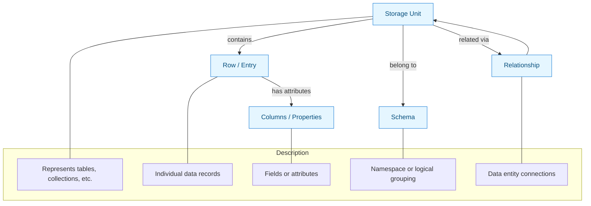

# Core Data Models & Object Abstraction

Unlock the power of universal data interaction with WhoDB’s foundational data models. This guide demystifies how WhoDB abstracts diverse database systems — SQL, NoSQL, and key-value stores — into a cohesive vocabulary and navigation framework that feels intuitive yet powerful.

---

## Introduction

Whether you work with PostgreSQL relational tables, MongoDB collections of documents, or Redis key-value pairs, WhoDB presents your data through a consistent set of core concepts. This abstraction empowers you to explore, query, and manipulate data across systems without adapting to wildly different interfaces or terminologies.

Here we explore the main elements:

- **Storage Units** — Unified representation of database entities like tables, collections, or key spaces
- **Rows (or Documents/Entries)** — Individual data records inside storage units
- **Columns / Properties** — Attributes or fields that describe each row
- **Relationships** — Connections between storage units capturing how data items link together
- **Schemas** — Logical groupings organizing storage units and relationships within a context

Each concept is designed to map cleanly onto multiple database paradigms while allowing WhoDB’s UI and AI capabilities to provide consistent, natural experiences.

---

## Storage Units: The Core Abstraction of Data Containers

A Storage Unit is the fundamental organizational unit within WhoDB. It represents any logical grouping of data entities, encapsulating a set of related rows or entries. The abstraction covers:

- **Relational Databases:** Tables in schemas
- **Document Stores:** Collections or views
- **Key-Value Stores:** Namespaces or key groups

### What You See in WhoDB

Each storage unit appears as a navigable entity in WhoDB’s UI, showing metadata such as:
- Name (e.g., `users`, `orders`)
- Type (table, view, collection, keyspace)
- Size and row count
- Structural attributes (like column types)

### Why It Matters

This unified model lets you jump between relational and NoSQL data without switching mental models. When you select a storage unit, you’re preparing to browse or query the contained rows using familiar tools.

---

## Rows (Entries): Your Data Records

Within a storage unit, data is organized as a set of rows or documents — the individual records.

- In SQL databases, these are table rows
- In MongoDB, they correspond to JSON-like documents
- In Redis or other key-value stores, these are key-value entries

### Interacting with Rows

WhoDB allows you to: 
- View rows with pagination for large datasets
- Edit data inline where permitted
- Add new rows with guided input
- Delete rows safely

Regardless of backend database, these operations feel consistent.

---

## Columns and Properties: Defining Attributes

Columns (or properties) represent the named attributes of rows within storage units. Behind the scenes, WhoDB derives columns depending on the data source:

- **For SQL:** Actual table columns with data types
- **For NoSQL:** Field keys present in documents; types inferred where possible

Columns are key to filtering, searching, sorting, and editing data.

### Schema Metadata

WhoDB enriches columns with metadata like:
- Data type (e.g., integer, text, boolean, JSON)
- Nullable or required status
- Index or primary key designations (for applicable databases)

This metadata powers intelligent UI behavior and query generation.

---

## Relationships: Mapping Connections Between Storage Units

Understanding data often means understanding how pieces relate. WhoDB captures relationships to reveal data structure and support complex queries.

### Types of Relationships:

- **One-to-One**
- **One-to-Many**
- **Many-to-One**
- **Many-to-Many**
- **Unknown / Unmapped** (when relationships can’t be inferred)

### How Relationships Are Identified

Relationships are inferred by plugins based on database metadata such as foreign key constraints in relational databases or index patterns in NoSQL systems.

They are represented visually in schema graphs and can be traversed directly.

---

## Schemas: Logical Groupings of Storage Units

Schemas organize storage units under a logical namespace or context.

- In SQL, schemas are explicit namespace containers
- In NoSQL, databases or namespaces often serve this role

WhoDB exposes schemas as the higher-level grouping that helps users orient themselves, discover related storage units, and scope queries.

---

## Unified Data Model in Action: User Journey Example

1. **Connect Your Database:** Choose a database and schema (or database namespace) to explore.
2. **Browse Storage Units:** View a list of tables or collections, each with rich metadata.
3. **Explore Relationships:** Use the schema visualization to understand how data entities link.
4. **Manage Rows:** Filter, search, edit, or add new rows with a uniform interface.
5. **Invoke AI Chat:** Ask natural language questions that operate across these abstractions seamlessly.

This consistent experience removes barriers between database types, enabling fluency and productivity.

---

## Tips and Best Practices

- **Familiarize Yourself with Storage Unit Types:** Knowing whether you’re working with a table, view, or collection helps predict capabilities.
- **Leverage Relationships:** Use the schema graph to formulate queries that span related storage units.
- **Use Filters Intuitively:** Columns are your leverages for precise data slices—experiment with filtering and sorting.
- **Mind Permissions:** Some editing actions may be disabled based on your security profile or database restrictions.

---

## Common Pitfalls and How to Avoid Them

- **Expecting Uniform Capabilities:** Not all database types support all operations (e.g., raw query execution vs. AI chat). Consult plugin-specific documentation if needed.
- **Overwhelmed by Large Datasets:** Use filters and pagination to maintain responsiveness.
- **Misunderstanding Relationships:** Auto-inferred relationships might miss complex or implicit links; use schema visualization for clarity.

---

## Diagram: Core Data Model Relationships

---

## Next Steps

To extend your mastery of WhoDB’s data abstractions:

- Explore the [Schema & Relationship Visualization Guide](/concepts/data-models/schema-visualization) for visual insights
- Dive into [Exploring and Managing Data](/guides/essential-workflows/exploring-and-managing-data) to learn data navigation and editing
- Try out the [AI Chat Guide](/guides/ai-and-natural-language/conversational-queries-and-ai-models) to query data naturally
- Review the [System Architecture Overview](/concepts/architecture-overview/system-architecture) for context on how these models fit into the platform

By developing a solid understanding of these core data models, you’ll unlock the full potential of WhoDB as a seamless, cross-database data management and AI query platform.

---