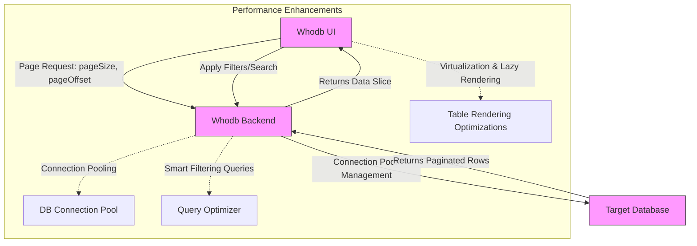

# Scalability & Performance Considerations

Whodb is designed to provide high responsiveness and efficiency even when managing large datasets and complex database schemas. This page explores the key techniques, architectural choices, and usage patterns that allow Whodb to maintain fast interactions while delivering a rich, user-friendly experience.

---

## The Performance Challenge

When interacting with databases, particularly those with large tables or complex relationships, users often face slow response times, delays in rendering, or cumbersome navigation. Whodb addresses these challenges by optimizing how data is fetched, displayed, and managed in the interface.

Consider a data analyst exploring a multi-million-row orders table: loading the entire dataset simultaneously would freeze any interface and degrade user experience. Whodb’s strategies prevent this by fetching only what is needed, when it is needed.

---

## Key Techniques for Scalability and Performance

### 1. Lazy Loading and Pagination

Whodb uses lazy loading to request data incrementally rather than all at once.

- **Pagination:** Data grids load a limited number of rows per page (default 10), which users can adjust. This keeps the UI responsive and reduces memory demands.
- **Dynamic Data Fetching:** As users navigate through pages or apply filters, Whodb fetches just the corresponding data slice.

> **User Value:** This approach ensures fast loading and fluid browsing without overwhelming system resources.

### 2. Table Virtualization

To efficiently display large numbers of rows, Whodb leverages table virtualization techniques:

- Only rows visible within the user’s viewport are rendered.
- As the user scrolls, off-screen rows are discarded from the DOM, and new rows are rendered.

This maintains smooth scrolling and quick rendering even for tables with thousands or more rows.

### 3. Smart Filtering & Query Optimization

Filters in Whodb intelligently adjust based on the database type and fields present:

- Filters generate efficient SQL or database-specific queries to limit results server-side.
- This reduces data transferred over the network and speeds up result delivery.

Example: Applying a filter on a product name or an order status initiates a query that fetches only matching records.

### 4. Connection Pooling & Backend Efficiency

While not exposed directly to users, Whodb’s backend manages database connections via connection pools to provide:

- Faster query response by reusing existing connections.
- Reduced latency when switching between queries or navigating datasets.

This ensures Whodb can handle multiple concurrent users or requests effectively.

### 5. Efficient API Request Handling & Pagination

The backend API supports:

- Pagination parameters such as `pageSize` and `pageOffset` to limit query scope.
- Query batching for the Scratchpad feature, allowing execution of multiple independent queries efficiently.

This keeps data transfer optimized and prevents server overload.

### 6. Deployment Considerations for Scale

For high-throughput or enterprise deployments, consider:

- Deploying Whodb in a containerized environment (Docker) with appropriate CPU and memory allocation.
- Running multiple Whodb instances behind a load balancer to distribute user load.
- Ensuring your database itself is scaled and optimized, as Whodb performance is also dependent on the database response times.

---

## User Experience Flow Highlighting Performance

Imagine a product manager examining sales data:

1. **Login and Selection:** The user logs in and selects the `orders` table.
2. **Lazy Data Fetch:** The first 10 rows load instantly.
3. **Filtering:** The user filters for orders with `status = completed`; only matching rows are fetched and displayed quickly.
4. **Pagination:** Navigating to page 5 triggers a new fetch of the corresponding rows.
5. **Inline Actions:** Editing a cell or adding a new row triggers a targeted update without reloading the entire dataset.

This flow keeps interactions snappy, avoids waiting on full dataset loads, and supports focused data exploration.

---

## Practical Tips and Best Practices

- For very large tables, keep page sizes moderate (10-50 rows) to balance detail and speed.
- Use filters early to narrow down datasets and reduce server and network load.
- Avoid opening many Scratchpad query cells simultaneously; close unused ones.
- Monitor backend logs to watch for slow queries and optimize indexes at the database level.
- For deployments serving many users, consider scaling out the backend and database separately.

---

## Common Pitfalls and Troubleshooting

<AccordionGroup title="Common Performance Issues & Solutions">
  <Accordion title="Slow Table Loading or UI Freezing">
  - Ensure that pagination is enabled and page size is not set excessively high.
  - Check network latency and backend response times.
  - Verify database indexes exist on commonly filtered columns.
  - Consider rebuilding the database statistics and caches.
  </Accordion>
  <Accordion title="Unresponsive Inline Editing or Data Saving">
  - Confirm that the database supports inline updates for the data type.
  - For Redis sets or MongoDB collections, inline editing may have limitations—refer to the documentation for unsupported field types.
  - Review error messages in the UI or logs for permission or connection issues.
  </Accordion>
  <Accordion title="Scratchpad Queries Execute Slowly or Timeout">
  - Avoid very heavy or complex queries without appropriate limits.
  - Break down large queries into smaller parts.
  - Confirm backend resource availability and database health.
  </Accordion>
</AccordionGroup>

---

## Summary Diagram: Data Flow Optimizations

---

## Next Steps

To further optimize and handle large datasets effectively:

- Explore the [Working Efficiently with Large Datasets](https://whodb.com/docs/guides/best-practices-and-optimization/working-efficiently-with-large-datasets) guide for UI-specific tips.
- Review deployment and [Scaling Strategies and Performance Optimization](https://whodb.com/docs/deployment/operationalization/scaling_performance) for production environments.
- Consult the [Security and Authentication Essentials](https://whodb.com/docs/guides/best-practices-and-optimization/security-and-authentication) for secure, performant configurations.

---

For detailed usage examples, refer to the [Exploring and Managing Data](https://whodb.com/docs/guides/essential-workflows/exploring-and-managing-data) guide and leverage the AI Chat interface for intelligent querying without heavy manual filters.

---

# Summary
This documentation explains the scalability and performance approaches Whodb employs to enable fast, efficient database interactions, even with large data volumes and complex structures. It covers lazy loading, pagination, virtualized rendering, connection pooling, smart filtering, and deployment strategies to maintain a smooth user experience.

Key sections include:
- The Performance Challenge
- Core Performance Techniques
- User Experience Flow
- Practical Tips & Troubleshooting
- Performance Data Flow Diagram
- Next Steps and Related Resources

Important links:
- [Working Efficiently with Large Datasets](https://whodb.com/docs/guides/best-practices-and-optimization/working-efficiently-with-large-datasets)
- [Scaling Strategies and Performance Optimization](https://whodb.com/docs/deployment/operationalization/scaling_performance)
- [Exploring and Managing Data](https://whodb.com/docs/guides/essential-workflows/exploring-and-managing-data)

Cross-references:
- System Architecture Overview
- Security and Authentication Essentials
- Scratchpad and Raw SQL Guide

To enhance your usage, start by applying filters early, keeping pagination reasonable, and monitoring your database performance for optimization opportunities.