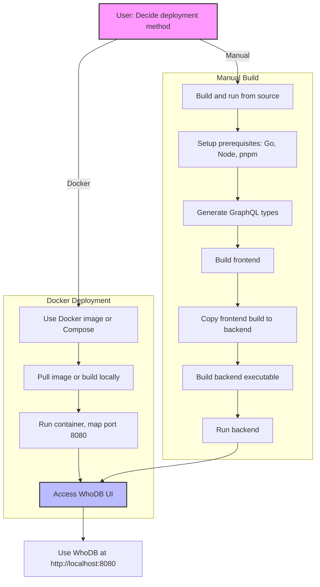

# How Do I Deploy or Run WhoDB?

Discover step-by-step guidance to launch WhoDB efficiently, whether using Docker, Docker Compose, or manual installation and builds. This guide covers both Community Edition (CE) and Enterprise Edition (EE) deployment methods, tips for configuration, and troubleshooting common issues during setup and runtime.

---

## Quick Start: Launching WhoDB Easily

### Running WhoDB Without Containers

The simplest way to start WhoDB is via the provided scripts for Community or Enterprise Edition. This method runs WhoDB directly on your host system.

<Steps>
<Step title="Start Community Edition">
Run the following in your project root:
```bash
./run.sh
```
Access the UI at [http://localhost:8080](http://localhost:8080).
</Step>
<Step title="Start Enterprise Edition">
Run the Enterprise Edition with:
```bash
./run.sh --ee
```
This requires EE source and modules.
</Step>
</Steps>

<Tip>
These scripts compile and start the Go backend with embedded frontend. Use `--ee` flag to switch editions.
</Tip>

### Development Mode with Hot Reload

For active development where code changes automatically reload the UI and backend:
```bash
./dev.sh           # For Community Edition
./dev.sh --ee      # For Enterprise Edition
```
Frontend dev server runs on [http://localhost:1234](http://localhost:1234) with hot reload.

---

## Deploying WhoDB with Docker

Docker offers a streamlined environment for deploying WhoDB with minimal local dependencies.

### Run with Docker

Pull and run the Community Edition image easily:
```bash
docker run -it -p 8080:8080 clidey/whodb
```
This runs WhoDB and exposes it on port 8080.

### Docker Compose Setup

Use the provided `docker-compose.yml` to manage containers and environment variables:
```yaml
version: "3.8"
services:
  whodb:
    image: clidey/whodb
    ports:
      - "8080:8080"
    environment:
      - WHODB_OLLAMA_HOST=localhost
      - WHODB_OLLAMA_PORT=11434
      - WHODB_ANTHROPIC_API_KEY=your_api_key_here
      - WHODB_OPENAI_API_KEY=your_api_key_here
    volumes:
      - ./data:/db
```
Start with:
```bash
docker-compose up
```

<Tip>
The volume mount `./data:/db` is optional but recommended for persisting SQLite data.
Configure AI API keys or Ollama host here if using conversational AI features.
</Tip>

### Building Docker Images Locally

You can build your own Docker images for CE or EE:

#### Build CE Image
```bash
docker build -f core/Dockerfile -t whodb:ce .
```

#### Build EE Image (requires EE access)
```bash
docker build -f core/Dockerfile.ee -t whodb:ee .
```

#### Multi-Architecture Build with Push

Enable Docker buildx and create a builder:
```bash
docker buildx create --use
```
Then build and push:
```bash
docker buildx build --platform linux/amd64,linux/arm64 \
  -t whodb-ce:latest \
  -f core/Dockerfile . --push
```

---

## Manual Build and Run Process

For full control or customization, build WhoDB manually from source.

### Prerequisites
- **Go 1.21+**
- **Node.js 18+**
- **pnpm** (`npm install -g pnpm`)
- **Git** (for version info)
- Optional: Docker, Make, Ollama (for AI chat)

### Step 1: Build Frontend

Navigate to the frontend directory:
```bash
cd frontend
```
Install dependencies if not done:
```bash
pnpm install
```
Generate GraphQL types with backend running (see GraphQL generation below).

Build frontend assets:
```bash
# Community Edition
pnpm run build

# Enterprise Edition
pnpm run build:ee
```

### Step 2: Copy Frontend Build to Backend

Remove previous embedded build and copy the new one:
```bash
rm -rf ../core/build
cp -r dist ../core/build
```

### Step 3: Build Backend

Change directory to core:
```bash
cd ../core
```
Build the Go binary:
```bash
# Community Edition
go build -o whodb

# Enterprise Edition
go build -tags ee -o whodb-ee
```

<Tip>
Backend compilation embeds the frontend build from `core/build` to serve assets seamlessly.
</Tip>

### Step 4: Run the Built Binary

Start the program:
```bash
# Community Edition
./whodb

# Enterprise Edition
./whodb-ee
```
Access WhoDB at [http://localhost:8080](http://localhost:8080).

### GraphQL Types Generation

When changing backend schema, regenerate GraphQL types before rebuilding frontend.

Prerequisites:
- Backend running on `http://localhost:8080` with introspection enabled (run backend in dev mode using `ENVIRONMENT=dev go run .`)

Generate types separately for editions:
```bash
# CE edition
cd core
ENVIRONMENT=dev go run .

# In another terminal
cd frontend
pnpm run generate:ce

# EE edition
cd core
ENVIRONMENT=dev go run -tags ee .

# In another terminal
cd frontend
pnpm run generate:ee
```

<Tip>
Always use the `@graphql` import alias in frontend code to ensure edition agnostic GraphQL types usage.
</Tip>

---

## Running WhoDB in Development

Run backend and frontend together with live reload for code changes:
```bash
./dev.sh          # Community Edition
./dev.sh --ee     # Enterprise Edition
```

Backend listens on 8080, frontend dev server on 1234 (hot reload enabled).

Press `Ctrl+C` to stop all running processes.

---

## Troubleshooting

### Common Issues

- **pnpm Not Installed**:
  Install globally:
  ```bash
  npm install -g pnpm
  ```

- **EE Directory Not Found**:
  Ensure you have access to EE modules and the `ee` directory resides in the project root.
  Run:
  ```bash
  ./scripts/validate-ee.sh
  ```

- **GraphQL Generation Fails**:
  Confirm backend runs with introspection enabled.
  Download Go module dependencies:
  ```bash
  cd core
  go mod download
  cd ../ee
  go mod download
  ```

- **TypeScript Errors During Build**:
  Run type check:
  ```bash
  cd frontend
  pnpm exec tsc --noEmit
  ```
  Refresh GraphQL types if needed.

- **Frontend Build Missing at Runtime**:
  Build frontend and copy to backend:
  ```bash
  cd frontend
  pnpm run build
  cp -r dist ../core/build
  ```

- **Port 8080 Already in Use**:
  Identify and stop the blocking process:
  ```bash
  lsof -i :8080
  kill -9 <PID>
  ```

### Clean Build Procedure

If persistent issues occur, clean all builds and dependencies:
```bash
./build.sh --clean          # CE clean build
./build.sh --clean --ee     # EE clean build
rm -rf core/build frontend/dist frontend/node_modules
rm -f core/whodb core/whodb-ee
```

---

## Best Practices and Tips

- Always build frontend before backend to embed assets correctly.
- Use the official build scripts (`build.sh`, `build-backend.sh`, `build-frontend.sh`) for consistency.
- For EE builds, run `./scripts/validate-ee.sh` before building to verify requirements.
- Use Docker for quick, consistent deployments, especially in production.
- Configure environment variables like `PORT`, `VITE_API_URL`, and edition-specific flags for custom deployments.

---

## Additional Help & Resources

- Full build and run instructions with environment configuration: [BUILD_AND_RUN.md](https://github.com/clidey/whodb/blob/main/BUILD_AND_RUN.md)
- Docker deployment guide: [Deploying with Docker & Docker Compose](https://whodb.com/docs/deployment/prod_deployment/docker_quickstart)
- EE validation and building: [scripts/validate-ee.sh](https://github.com/clidey/whodb/blob/main/scripts/validate-ee.sh)
- GraphQL generation details: [frontend/GRAPHQL_SETUP.md](https://github.com/clidey/whodb/blob/main/frontend/GRAPHQL_SETUP.md)

For support, contact support@clidey.com or file an issue on GitHub.

---

## Summary Flow Diagram



---
