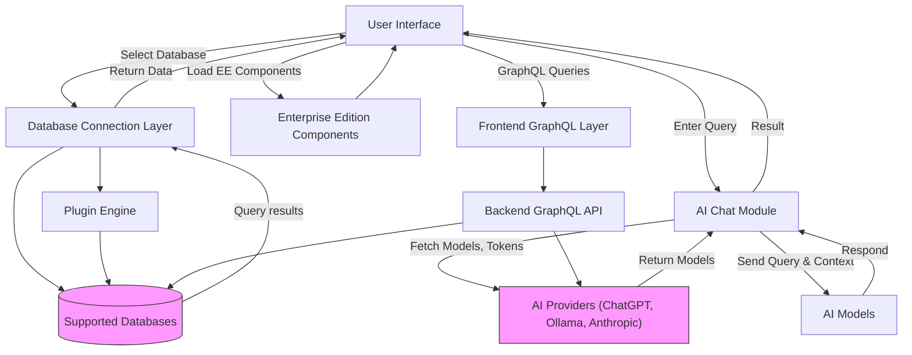

# Integrations and Extensibility

Welcome to the Integrations and Extensibility overview for WhoDB — your gateway to connecting your databases, AI providers, and external systems seamlessly. This page demystifies how WhoDB interfaces with various components behind the scenes, empowering you to extend its functionality or integrate new data sources confidently.

---

## Unlocking Unified Connections

WhoDB isn’t just another database tool. It acts as a centralized hub, linking your SQL, NoSQL, and cloud data stores with powerful AI models and extensible plugins. This page guides you through the integration landscape designed for both Community Edition (CE) and Enterprise Edition (EE) users, outlining key mechanisms, supported platforms, and future extensibility paths.

### What You Will Discover Here
- How WhoDB connects with industry-standard databases like PostgreSQL, MySQL, and MongoDB.
- The identity and authentication methods WhoDB supports for secure database access.
- Integration with leading large language model (LLM) providers such as ChatGPT, Ollama, and Anthropic.
- The plugin architecture that enables extension of the core platform, especially in EE.
- How dynamic GraphQL imports manage CE and EE codebases for integration consistency.

---

## Database Connectivity: Broad, Secure, Seamless

### Supported Databases
WhoDB offers first-class support for a wide array of database types, including but not limited to:
- Relational Databases: PostgreSQL, MySQL, MariaDB, SQLite3, ClickHouse
- NoSQL Databases: MongoDB, Redis, ElasticSearch

This ensures that no matter your technology stack, WhoDB can be your unified interface to explore, query, and manage data.

### Authentication Mechanisms
WhoDB supports flexible authentication to meet enterprise security requirements:
- Login profiles with saved credentials allow quick switching between environments.
- Environment-defined credentials enable CI/CD and cloud deployments without exposing secrets.
- Advanced settings allow custom authentication parameters.

### Plugin Engine Extensibility
Both CE and EE editions use a plugin system that wraps database drivers to provide consistent functionality across databases. In EE, the plugin engine extends to enable:
- Enterprise-grade database support
- Advanced connection options
- Custom schema handling

This modular architecture future-proofs your WhoDB deployment for integrating new database systems.

---

## Conversational AI and LLM Integration

WhoDB integrates deeply with conversational AI models to enable natural language querying and data exploration.

### Supported AI Providers and Models
- **ChatGPT**: OpenAI’s widely used large language model.
- **Ollama**: Locally hosted model support, allowing on-prem AI.
- **Anthropic**: Cutting-edge assistant focused on safety and reliability.

With the ability to add external AI models dynamically through tokens and provider selection, you can tailor the AI assistance to your organizational needs.

### Token and Model Management
Users authenticate and select models via WhoDB’s interface where:
- Providers are discovered dynamically via a GraphQL query.
- Model types and tokens are configured securely.
- Model lists are refreshed on-demand to reflect availability.

### AI Chat in Practice
The AI chat interface lets you:
- Ask questions in natural language.
- Receive SQL queries and results inline.
- Visualize data with charts when supported (EE specific).

This integration generates real-time insights, making data access intuitive and conversational.

---

## Plugin Extensibility and Enterprise Features

### Dynamic Component Loading
To support advanced features and EE-only components, WhoDB employs dynamic imports:
- EE components like advanced charts and analytics load only when enabled.
- This keeps the CE lightweight while giving EE customers enhanced visualizations and analytics.

### Extensible Themes and UI Components
The system’s design supports new themes and UI components that can be plugged in:
- EE themes can be loaded at runtime, offering brand customization.
- Components like enhanced data tables are extensible through well-defined extension points.

### Future Integration Paths
WhoDB is architected to integrate future databases and AI providers seamlessly through:
- The GraphQL schema which abstracts backend features.
- The plugin engine which encapsulates database-specific behavior.
- Feature flags controlling availability without code changes.

---

## How WhoDB Manages Integration Consistency: GraphQL Setup

### Unified GraphQL Types
WhoDB’s frontend uses GraphQL code generation to tightly couple with backend APIs:
- CE and EE editions have separate GraphQL schemas, each generating their own TypeScript types.
- The `@graphql` import alias dynamically resolves to CE or EE types based on build environment.

### Build and Development Workflow
- Developers generate GraphQL types from the running backend.
- The Vite config dynamically aliases imports to the correct generated code.
- This ensures that both editions stay consistent with their respective backend capabilities.

### Benefits to You
- Avoids conflicts between CE and EE types.
- Maintains API stability and type safety.
- Enables advanced features in EE without impacting CE builds.

---

## Integration Workflow Example: Adding an External AI Model

1. Navigate to the AI provider dropdown in the Chat interface.
2. Select 'Add External Model' to open the token input modal.
3. Choose your AI model type (e.g., Ollama, Anthropic).
4. Enter the API token securely.
5. Submit to load and register the external AI model dynamically.
6. Begin querying with the new AI provider seamlessly.

This flow empowers users to flexibly extend WhoDB’s AI capabilities without redeployment.

---

## Best Practices and Tips

- **Secure Tokens:** Always manage your AI or database tokens through environment variables or secure vaults.
- **Refresh Models:** If AI models don't appear, try refreshing the provider list.
- **Use Plugins:** Leverage plugins to add support for custom databases or enterprise features.
- **Monitor Feature Flags:** EE feature availability is controlled via flags; consult your admin if something seems missing.

---

## Troubleshooting Common Integration Issues

<AccordionGroup title="Common Issues with Integrations">
<Accordion title="Unable to Connect to AI Provider">
Ensure your token is valid and properly set. Verify network connectivity and check for API limits or permissions from the provider.
</Accordion>
<Accordion title="Database Login Fails">
Check that your credentials are correct. Confirm that environment-defined profiles are properly configured if used. Review network firewall or access control settings.
</Accordion>
<Accordion title="GraphQL Types Seem Outdated">
Run `npm run generate` or `pnpm generate` after backend schema changes. Confirm your local backend is running and accessible on port 8080.
</Accordion>
</AccordionGroup>

---

## Next Steps

- Explore detailed guides on [Connecting to Your Database](/guides/essential-workflows/connecting-to-your-database).
- Learn about [Conversational AI Integration](/concepts/integration-patterns/ai-integration) to deepen your AI usage.
- For Enterprise customers, investigate [Plugin Engine & Database Integration](/concepts/architecture-overview/plugin-engine) for custom extensibility.

---

By understanding WhoDB’s integrations and extensibility mechanism, you can fully harness its power as a unified platform for your diverse data ecosystems and the latest conversational AI capabilities.

---

## Diagram: Integration Overview Flow

---