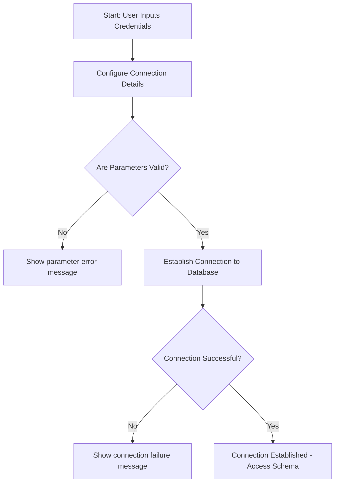

# Connecting to Your Database

Welcome to the guide that gets you connected and up running with your databases in WhoDB. Whether your data lives in PostgreSQL, MySQL, SQLite3, MongoDB, Redis, or ElasticSearch, this page walks you through each connection type's requirements, credential setup, profiles, and how to troubleshoot connection obstacles to streamline your onboarding.

---

## 1. Workflow Overview

### What this guide helps you accomplish
This guide leads you through establishing successful connections from WhoDB to popular databases, ensuring your credentials and connection options are set properly for smooth integration. You will learn how to specify connection parameters, use profiles, and troubleshoot issues to quickly interact with your data.

### Prerequisites
- Have your database running and accessible via network.
- Obtain correct credentials: hostname, port, username, password, and database name.
- Confirm network connectivity and access rights.
- For SQLite3, have your database file prepared.

### Expected outcome
You will have WhoDB configured to connect securely and efficiently to your chosen database system, verified through successful connection tests and ready for exploration.

### Estimated time
10-20 minutes per database connection

### Difficulty level
Beginner to Intermediate depending on familiarity with database connection concepts

---

## 2. Step-by-Step: Connecting to Common Databases

### 2.1 General Connection Settings

Every database connection requires key values:
- **Hostname**: The address of your database server.
- **Port**: Network port (default varies per database).
- **Username and Password**: Credentials with access privileges.
- **Database name**: The specific database or schema to connect to.
- **Advanced options**: Settings like SSL mode, connection timeouts, or protocol tweaks.

Use these consistently in the database credential forms or configuration profiles.

---

### 2.2 PostgreSQL Connection

1. **Default port:** `5432`
2. **Credential parameters:**
   - Hostname
   - Port
   - Username
   - Password
   - Database
   - Extra options as needed (e.g., runtime parameters)

3. **How WhoDB connects:**
   - Uses pgx with GORM for ORM support
   - Supports runtime parameter overrides

4. **Tips:**
   - Use URL encoding for special characters in credentials
   - Add custom runtime parameters via the "Advanced" section

5. **Verify:** Successful connection leads to schema discovery and access to tables.

---

### 2.3 MySQL Connection

1. **Default port:** `3306`
2. **Credential parameters:**
   - Hostname
   - Port
   - Username
   - Password
   - Database
   - Parse Time (bool)
   - Allow Cleartext Passwords (bool)
   - Additional query parameters

3. **How WhoDB connects:** Uses GORM with the Go MySQL Driver

4. **Best practices:**
   - Enable `ParseTime` to correctly handle date/time types.
   - Set `AllowClearTextPasswords` if your server requires.

5. **Verify:** Check connection by enumerating databases and tables.

---

### 2.4 SQLite3 Connection

1. **Database file**: Use the full path to your SQLite database file. For development, default folder is `tmp/`; for production, `/db/`.
2. **Permissions:** Ensure WhoDB has read and write access.
3. **How WhoDB connects:** Uses GORM SQLite driver opening the file.
4. **Pitfalls:**
   - Symlinks are resolved; database file must be inside allowed directory.
   - Missing file or no permission leads to an error.

5. **Verify:** Connection means you can browse tables within your SQLite file.

---

### 2.5 MongoDB Connection

1. **Default port:** `27017`
2. **Credential parameters:**
   - Hostname
   - Port
   - Username
   - Password
   - Database
   - DNS Enabled (bool) - whether to use MongoDB's DNS seed list connection string (mongodb+srv)
   - URL Params (optional query parameters)

3. **How WhoDB connects:** Uses official MongoDB Go driver
4. **Tips:**
   - Set `DNS Enabled` to true if connecting to MongoDB Atlas or SRV-based clusters.
   - Include any additional connection parameters via `URL Params` string.

5. **Verify:** Connection success allows listing collections and querying documents.

---

### 2.6 ClickHouse Connection (Enterprise Edition)

1. **Default port:** `9000`
2. **Credential parameters:**
   - Hostname
   - Port
   - Username
   - Password
   - Database
   - SSL Mode (disable|none|relaxed)
   - HTTP Protocol (enable|disable)
   - Debug (enable|disable)
   - Readonly (enable|disable)

3. **Tips:**
   - Enable TLS if your ClickHouse instance supports it.
   - Adjust debug mode for troubleshooting.

4. **Verify:** Connection test and ability to query ClickHouse tables.

---

## 3. Using Profiles for Connection Management

WhoDB supports configuration profiles that allow you to save and reuse credential sets. Profiles can include additional advanced parameters beyond typical connection fields, improving security and convenience.

- To use a profile, mark the credential set as a profile when adding.
- Profiles allow parameterized overrides like SSL options and custom connection timeout.
- Profiles help manage multiple database connections efficiently.

<Tip>
Use profiles to separate development, staging, and production databases to avoid confusion or accidental cross-connection.
</Tip>

---

## 4. Practical Examples

<AccordionGroup title="Database Connection Examples">
<Accordion title="Example PostgreSQL Connection Configuration">
```yaml
Hostname: "db.example.com"
Port: "5432"
Username: "admin"
Password: "s3cret"
Database: "myapp"
Advanced:
  sslmode: "require"
  timezone: "UTC"
```
</Accordion>

<Accordion title="Example MongoDB Connection Parameters">
```yaml
Hostname: "cluster0.mongodb.net"
Port: "27017"
Username: "mongouser"
Password: "pass123"
Database: "test_db"
Advanced:
  DNS Enabled: "true"
  URL Params: "?retryWrites=true&w=majority"
```
</Accordion>
</AccordionGroup>

---

## 5. Troubleshooting Common Connection Issues

<AccordionGroup title="Troubleshooting Tips">
<Accordion title="Cannot Connect to Database">
- Verify hostname and port are correct and accessible from the WhoDB host.
- Check firewall or network restrictions.
- Confirm credentials are valid and have the required permissions.
- For cloud or managed DBs, confirm IP whitelist includes your server.
- Review SSL requirements—enable or disable SSL as needed.
</Accordion>

<Accordion title="Authentication Errors">
- Double-check username and password spelling.
- Use proper URL encoding for special characters.
- Use cleartext password options if needed (MySQL).
- Confirm that the user has permission to access the specified database.
</Accordion>

<Accordion title="SQLite Specific Errors">
- Ensure the SQLite database file exists and is in the expected path.
- Make sure WhoDB process has read/write permissions.
- Symlinked files outside the allowed folder will cause connection failure.
</Accordion>

<Accordion title="MongoDB SRV Record or DNS Errors">
- If using MongoDB Atlas or SRV, ensure DNS Enabled option is true.
- Verify `URL Params` are properly formatted.
- Ensure the MongoDB driver version used by WhoDB matches cluster requirements.
</Accordion>
</AccordionGroup>

---

## 6. Next Steps & Related Documentation

- After successful connection, proceed to [Exploring and Managing Data](/guides/essential-workflows/exploring-and-managing-data) to learn schema navigation and data browsing.
- For security best practices, see [Security and Authentication Essentials](/guides/best-practices-and-optimization/security-and-authentication).
- Need help resolving connection issues? Visit [Troubleshooting Common Issues](/getting-started/troubleshooting/troubleshooting-common-issues).

<Tip>
Keep your credentials secure. Avoid sharing passwords and consider integrating encrypted secrets managers if available.
</Tip>

---

## 7. Visual Summary Diagram of Typical Connection Flow



---